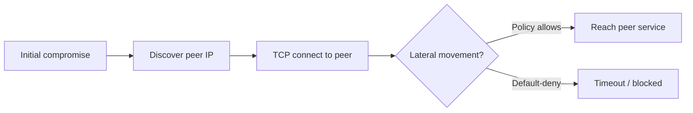

# Scenario 07 — Lateral Movement (pod-to-pod)

**MITRE:** T1021 — Remote Services · T1046 — Network Service Discovery

## Threat model

### What we are protecting

| Asset | In this lab | Why it matters |
|-------|-------------|----------------|
| **Peer workloads** | Pod `scenario-07-peer` (simulated internal service) | Stands in for a database, admin API, or backend only meant to be reached via controlled paths |
| **East-west boundary** | All pods in the **`security-lab`** namespace | One compromised pod must not freely reach every other pod in the same namespace |
| **Cluster network** | Pod CIDR (e.g. `10.244.0.0/16`) | Pod IPs are reachable inside the cluster; without policy, any foothold can scan and connect east-west |

### Adversary profile

| Attribute | Description |
|-----------|-------------|
| **Starting point** | Already has code execution inside a pod (RCE, stolen creds, supply-chain compromise — see scenarios 01–03) |
| **Objective** | Reach another workload in the same namespace to steal data, pivot, or escalate |
| **Techniques** | Discover peer IPs (Kubernetes API, env vars, subnet scan), then probe or connect on TCP (HTTP, DB ports, etc.) |
| **Out of scope** | External attacker hitting Ingress; cross-namespace movement (same principles, different policies) |

### Assumptions

- Attacker traffic originates **inside** the cluster (compromised pod on the pod network).
- Attacker and target are in the **`security-lab`** namespace — the common “flat namespace” case when micro-segmentation is missing.
- **Primary control** is NetworkPolicy, not Falco — the connection is blocked before meaningful application traffic.

### Impact if unmitigated

Successful east-west access lets an attacker bypass perimeter controls, reach internal-only services, and move toward high-value targets (metadata APIs, cluster DNS, unauthenticated admin ports on peer pods).

---

## Attack vector (detailed)

### Kill chain



1. **Foothold**  
   Attacker controls `scenario-07-attacker` in **`security-lab`**. In production this is any compromised pod in a sensitive namespace.

2. **Discovery (T1046)**  
   Real attackers enumerate targets via:
   - Stolen service account + Kubernetes API (`kubectl get pods -o wide`)
   - Environment variables and service discovery
   - Scanning the pod CIDR for live hosts  

   The simulation skips recon and injects the peer IP from the API (same information an attacker with API access would have):

   ```bash
   PEER_IP=$(kubectl get pod scenario-07-peer -o jsonpath='{.status.podIP}')
   ```

3. **Connection attempt (T1021)**  
   From inside the attacker pod, `wget` initiates **TCP** to the peer’s pod IP on port 80:

   ```bash
   wget -T 2 -qO- http://${PEER_IP}
   ```

   This models:
   - Hitting an internal HTTP admin panel from a compromised frontend pod  
   - Probing a backend that was never exposed via Ingress  
   - Direct pod-IP access (common when the adversary already knows IPs from the API)  

   The peer pod does not run an HTTP server; with **permissive** networking you would often see `Connection refused`. With **default-deny**, Cilium drops packets in the datapath and the client sees **`download timed out`** — still a failed lateral movement, but blocked at the **network** layer before reaching the peer.

4. **Why pod IP instead of Service DNS?**  
   ClusterIP Services add indirection and RBAC around the API. Attackers frequently connect to **pod IPs** once discovered. The security property under test is the same: **east-west traffic inside `security-lab`**.

---

## Response (detailed)

Scenario 07 relies on **network segmentation** first. The Falco → webhook → SOAR path (scenarios 01, 03–05) is optional reinforcement, not the primary control here.

### Layer 1 — Prevention (automatic)

**Control:** `default-deny-all` NetworkPolicy in **`security-lab`**

```yaml
# lab/network-policies/default-deny.yaml
podSelector: {}          # every pod in the namespace
policyTypes: [Ingress, Egress]
# no allow rules → deny all ingress and egress unless another policy explicitly permits
```

| Pod | Ingress | Egress |
|-----|---------|--------|
| `scenario-07-attacker` | Denied from peer (and all others) | Denied to peer IP (and all destinations) |
| `scenario-07-peer` | Denied from attacker | Denied to attacker |

Cilium enforces this in the eBPF dataplane. The `wget` probe **times out** — lateral movement is stopped **before** any process on the peer accepts traffic.

**Exception in this lab:** only the baseline **`app=victim`** pod has a separate `allow-dns-egress` policy (UDP/TCP 53 to `kube-system`). Scenario 07 pods have **no** allow rules, so they remain fully isolated from each other.

### Layer 2 — Detection (observability)

**Control:** Cilium **Hubble** (enabled in k8s-soar)

Even when traffic is denied, operators can inspect **dropped flows**:

```bash
hubble observe --namespace security-lab --verdict Dropped
```

Typical fields: source pod, destination IP/port, policy name, drop reason. This is the main **forensic** signal for scenario 07 — Falco is not the primary detector because no application session is established on the victim.

### Layer 3 — Containment (suspect pod)

If a pod is **known compromised** (incident response, or a Falco alert from another scenario), apply **quarantine**:

```bash
kubectl label pod -n security-lab scenario-07-attacker security.quarantine=true --overwrite
```

**Effect:** `k8s-soar-quarantine` CiliumNetworkPolicy selects `security.quarantine=true` and **denies all ingress and egress** for that pod — cutting it off even if a misconfigured allow policy existed elsewhere.

Verify:

```bash
kubectl exec -n security-lab scenario-07-attacker -- wget -T 2 -qO- http://1.1.1.1 || echo isolated
```

In other scenarios, the same label is applied **automatically** by the SOAR responder webhook after Falco alerts.

### Response summary

| Phase | Mechanism | Outcome in scenario 07 |
|-------|-----------|-------------------------|
| **Block** | Default-deny NetworkPolicy | Pod-to-pod probe fails (timeout / `blocked`) |
| **Observe** | Hubble | Dropped flow recorded (optional) |
| **Contain** | Quarantine label + CNP | Suspect pod fully isolated (manual demo or SOAR) |

---

## Scenario flow

| Step | Layer | What happens |
|------|-------|--------------|
| 1. **Attack** | Adversary | In **`security-lab`**, `scenario-07-attacker` probes `scenario-07-peer` via pod IP (HTTP/wget). |
| 2. **Prevention** | NetworkPolicy | Default-deny blocks east-west traffic — connection times out. |
| 3. **Detection** | Hubble | Denied flow visible in Hubble (optional). |
| 4. **Response** | Quarantine | Label `security.quarantine=true` to isolate a confirmed-compromised pod. |

## Run

```bash
./run.sh
```

## Expected evidence

| Tool | Expected |
|------|----------|
| NetworkPolicy | `wget: download timed out` or `blocked` |
| Hubble | `Dropped` verdict between attacker and peer pods |
| Falco | — (not primary for this scenario) |
| SOAR | Manual quarantine demo, or automatic via Falco-driven webhook in other scenarios |

## Capture

```bash
hubble observe --namespace security-lab --verdict Dropped
kubectl get networkpolicy -n security-lab
kubectl describe networkpolicy default-deny-all -n security-lab
```

## Manual quarantine demo

```bash
kubectl label pod -n security-lab scenario-07-attacker security.quarantine=true --overwrite
kubectl exec -n security-lab scenario-07-attacker -- wget -T 2 -qO- http://1.1.1.1 || echo isolated
```
